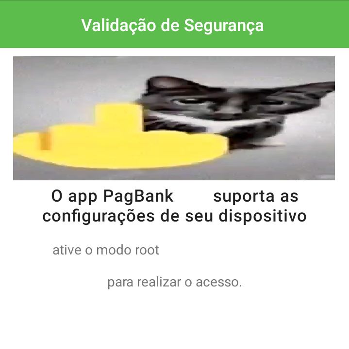

# PagBank Root Bypass

  &lt;-----baixe aqui 

Um módulo [LSposed](https://github.com/LSPosed/LSPosed) que deixa você usar o app PagBank com root.

## O quê?

Desde a versão do dia 20 de Janeiro de 2023, métodos comuns para esconder root pararam de funcionar no app do PagSeguro. Esse módulo tira completamente a tal da "Verificação de segurança" do app.

Se isso te afeta, você só precisa instalar o [apk do módulo](https://github.com/dzshn/pagbank-root-bypass/releases/latest) e ativar-lo no LSposed.

## Porquê?

Existem dois motivos principais que podem justificar o PagSeguro de bloquear o app de dispositivos rooteados:

1. Proteje o aplicativo deles de ser modifícado
2. Proteje usuários de perderem suas contas caso algum vírus use root de alguma forma

Eu vou contra esses dois pontos. O primeiro é até irónico, pois eu nunca íria tentar modificar o app se eles não tivessem este bloqueio. De qualquer forma, eu acredito que rootear é um direito seu e não é motivo para marcar um usuário como potencialmente suspeito ou algo assim. O segundo motivo é até compreensível, mas é apenas uma responsabilidade que se tem.

## Aviso

Este software é providenciado sem quaisquer garantias e responsabilidades sobre a autora. [Todo o software está sobrea a licença MIT](LICENSE).

  
English

  An [LSposed](https://github.com/LSPosed/LSPosed) module that lets you use the PagBank app with root.

  ## What?

  Since the update on January 20, 2023, common methods to hide root stopped working on PagSeguro's app. This module completely removes the "Security verification" thing from the app.

  If this affects you, you only need to install the [module's apk](https://github.com/dzshn/pagbank-root-bypass/releases/latest) and activate it on LSposed.

  ## Why?

  There are two main reasons that justify PagSeguro from blocking rooted devices:
  
  1. Protects their app from being modified
  2. Protects users from losing their accounts in case a virus uses root somehow

  I stand and go against both of these points. The first one is practically ironic, since I would've never modified the app if this block wasn't in place. In any case, I believe rooting is your own right and is not a reason to mark users as "potentially suspicious" or whatever. The second reason is comprehensible, but is just a responsibility you have.

  ## Disclaimer

  This software is provided as-is, without warranty or responsibilities over the author of any kind. [The software is licensed under MIT](LICENSE).

